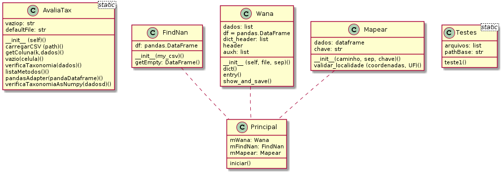

# Entrega das atividades

## Grupo

- Felipe
- Wana
- Andre
- Alexandre

## Progresso

Os detalhes estão em:

https://github.com/felipexp8/Avaliando_qualidade_dados_de_ocorrencia/projects/1

## Wiki

Documentação:

https://github.com/felipexp8/Avaliando_qualidade_dados_de_ocorrencia/wiki/Challenge-OOP2

## Relatório

- Item 1 Adicionado. Opera com Pandas
  - Carrega arquivos CSV e valida todos os campos
- Item 2 Adicionado. Opera com Numpy
  - Por padrão os dados de entradas são listas com str()
  - Tem adaptador de Pandas para List()
- Item 3 Adicionado. Opera com Pandas
  - Suporta _True Color_ no console
- Item 4 Adicionado. Opera com Pandas
  - Tem função dedicada para validar se o estado está nas coordenadas corretas
  - **Especial**: Plotagem gráfica das coordenadas
- Item 5 Adicionado. Testes e resultados no arquivo report
- Item 7 Adicionado. Teste em outros arquivos do icmBio
  - Classe dedicada para testes
- Item 8 Adicionado. Realizando teste de ferramentas do grupo do Vitor
  - Pacote: `analisadados.AnalisadordeDados`

Adicionado o diagrama de classes simplificado. A class AvaliaTax e de Testes tem seus métodos estáticos (podem ser chamados sem instanciar). As demais classes devem ser instanciadas com seus devidos parâmetros

## UML

Diagrama de classes do _Unified Modeling Language_



## Libs e dependências utilizadas:

  - Numpy
  - Pandas
  - Matplotlib
  - Shapefile
  - Mpl_toolkits.basemap 
  - Opencage.geocode
  - Csv
  
  
## Dúvidas frequentes

### Métodos estáticos

Esta classe utiliza métodos estáticos @staticmethod
Estes métodos podem ser acessados fora dos objetos, como se fosse uma função solta. Equivale ao agrupando das funçoes para não ficaram perdidas no escopo ao importar para outros arquivos, praticamente é um módulo.
```
 exemplo: from AvaliaTax import * 
 meusDados = leiaTudo(arquivo)
 AnaliaTax.verificaTaxonomia(meusDados)
 
 # Não precisa fazer:
 meuObjeto = AvaliaTax()
 # e depois: 
 meuObjeto.verificaTaxonomia(meusDados)
 ```
 
 pois neste projeto só vai ter 1 objeto AvaliaTax, não faz sentido eu criar mais de um (por enquanto)
 
 Quando uma classe vira um aglomerado de funções, para projetos pequenos, creio que fica mais fácil de entender. 
 Qualquer coisa basta remover a linha @staticmethod que tudo funcionará normalmente.
 
 ### Como usar a classe AvaliarTax
 
Passos:

1. Carregue um arquivo CSV através da classe FindNaN. Exemplo:
 ```
myFindNaN = FindNaN("portalbio_export_04-11-2019-20-55-04.csv")
```

2. Use o adaptador para converter o tipo _FrameData_ do pandas para o _Numpy_ com os devidos cabeçalhos
 
```
dadosN = AvaliaTax.pandasAdapter(myFindNaN.df)
```
3. Use a seguinte função (ela retornará uma lista associando cada linha com seu respectivo nível taxonômico)``
```
res2 = AvaliaTax.verificaTaxonomiaAsNumpy(dadosN)
```
 
 
  
 
